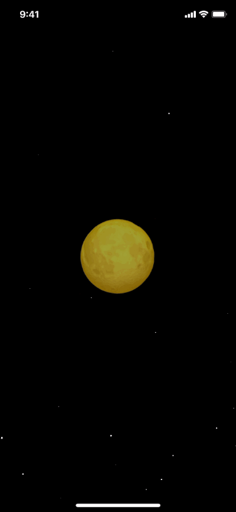

# Orbital-SwiftUI-Animation

An experiment for using SwiftUI's [custom timing Animation](https://developer.apple.com/documentation/swiftui/animation/timingcurve(_:_:_:_:duration:)) to create an orbital-like animation.

## How it looks:

## How it works:

- Applying a custom timing animation to an offset modifier to make it move far more forward and then far more backward before reaching it's final destination, and making this animation repeating forever with autoreverse set to false. 

- The custom timing curve looks like this (X-axis is duration from zero to one, Y-axis is displacement):

- The moon is getting it's z-index toggled periodically above and below the planet (using a timer) to give the illusion that the planet is orbiting around it

- The moon light is a black overlayed circle over the moon that gets it's opacity periodically aniamted between 0 and 0.6 

- The stars are just a particle effect created using a `CAEmiterLayer`, emitter code is basically from this ![SO answer][https://stackoverflow.com/a/61711171/3846724]

